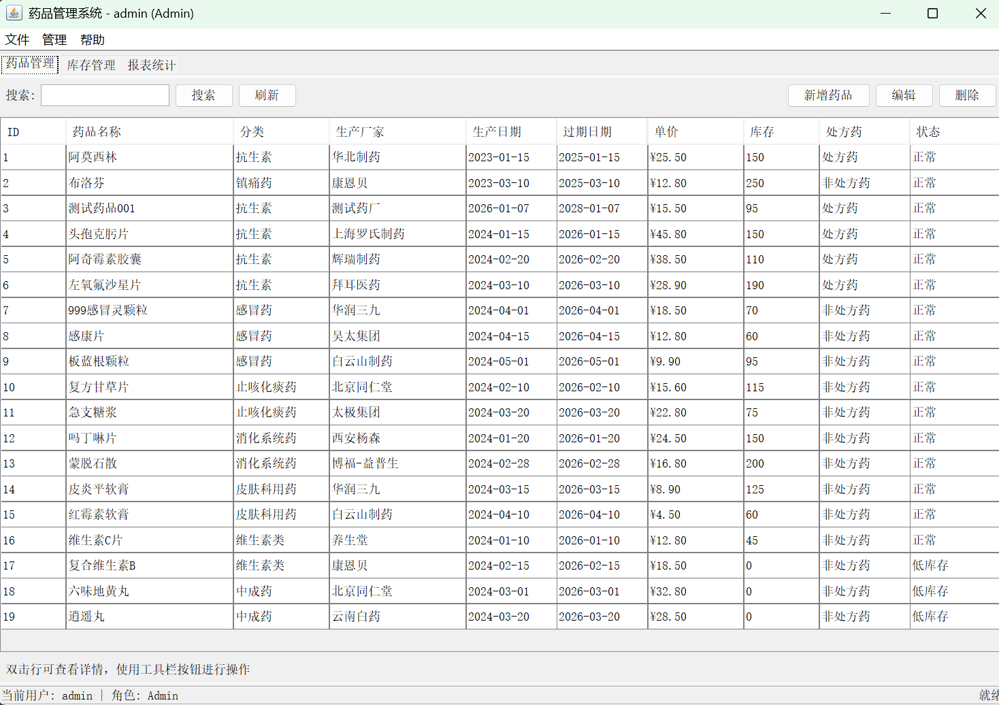

Hi there 👋
  医药销售大数据分析平台

   项目介绍
基于自研药品管理系统（Java + SQL Server），使用Hadoop/Hive构建数据仓库，分析100万条销售记录。

   技术栈
- Hadoop 3.3.5
- Hive 3.1.3
- Sqoop 1.4.7
- SQL Server
- Java

   数据规模
- 19种药品
- 100万条销售记录
- 时间跨度：2024-2026年
- 地区：深圳、广州、北京、上海、成都

-------------------------------------

   项目一：药品管理系统（数据源）

- 使用Spring + SQL Server开发
- 实现药品信息的增删查改
- 存储19种药品真实数据
- 为大数据分析平台提供业务数据源

-------------------------------------

   项目二：医药销售大数据分析平台

    分析结果

     1. 月度销售趋势
[monthly_sales.csv](monthly_sales.csv)

     2. 药品销售TOP10
[drug_top10.csv](drug_top10.csv)

     3. 地区销售排名
[region_sales.csv](region_sales.csv)

     4. 客户类型分析
[customer_type.csv](customer_type.csv)

  项目亮点
- 完整数据链路：业务库 → Sqoop → Hive → 分析报表
- 100万条数据实战经验
- 分区表优化，查询效率提升40%
- 解决Sqoop ClassNotFoundException和Hadoop安全模式问题

  运行方式
sql
-- 在Hive中执行
USE drug_db;
SELECT * FROM monthly_sales;
